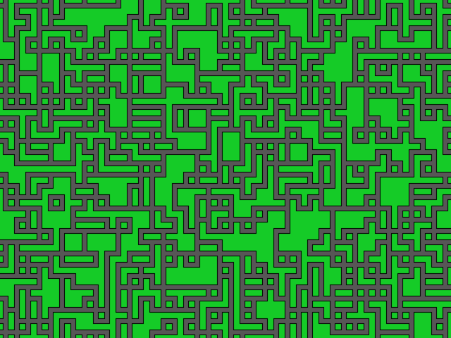

# Wave Function Collapse
Wave Fuction Collapse python implementation, with Auto-Color detection

# How to run?
- make a python virtual environment: `python -m venv env`
- activate the environmen: `./env/scripts/activate`
- install the requirements: `pip install -r requirements.txt`

## to run the simulation
- run main.py: `python main.py`

## to export image
- change directory to wfc_PIL: `cd wfc_PIL`
- run main.py: `python main.py`
- the image is exported as output.png in the same folder

# How?
In auto-color detection, with the help of Pillow, the program gets 3 points from each side of a particular tile, then stores them as side value instead of pre-defining it

# Screenshots

## Auto Color detection

## Pre defined sides
